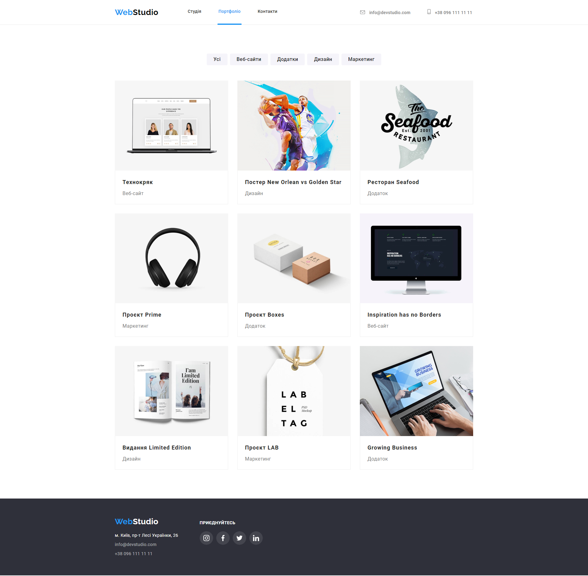

# WebStudio website

## Homework#05

Added animation of decorative effects for
[Layout markup](<https://www.figma.com/file/1ehrLBauvVFu4mVhxsHzyZ/Web-Studio-(Version-2.1)?node-id=1%3A2125&mode=dev>).
Configured GitHub Pages and added a [link](https://valerii2022.github.io/goit-markup-hw-05-FSON/) to
the live page in the GitHub-repository header.

### [Main Page](https://valerii2022.github.io/goit-markup-hw-05-FSON/)

### [Portfolio Page](https://valerii2022.github.io/goit-markup-hw-05-FSON/portfolio.html)

